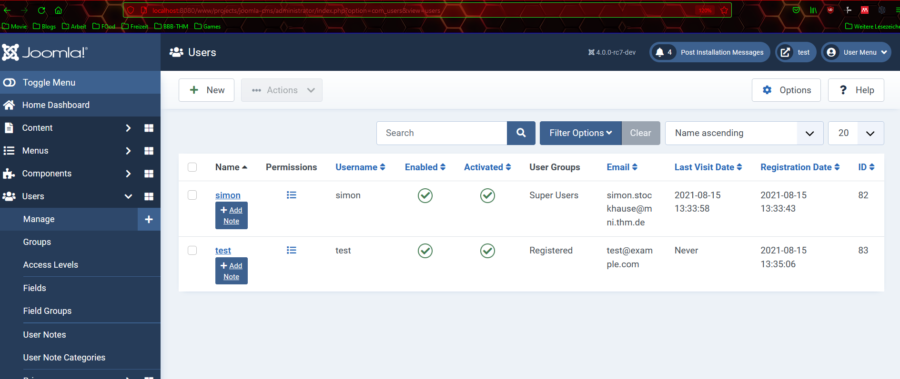
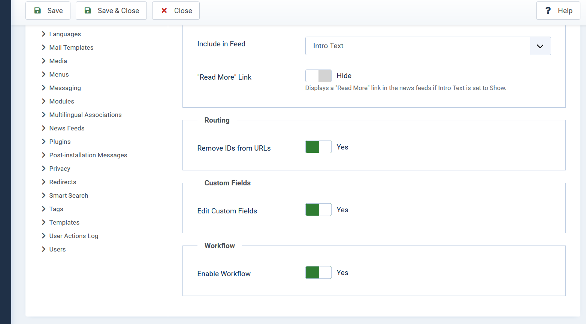
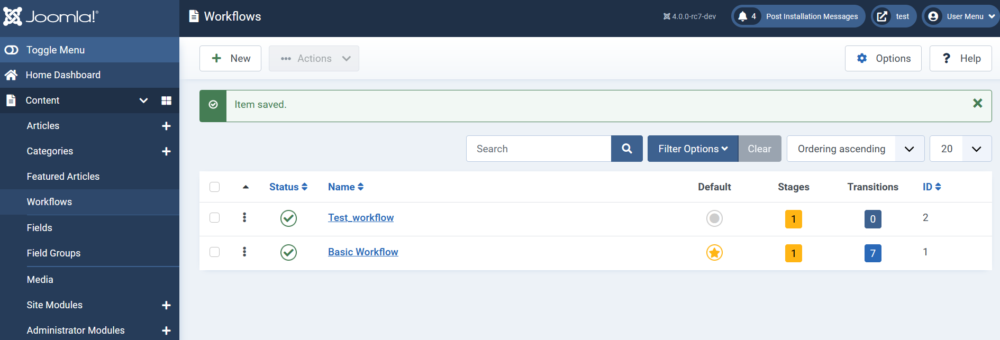
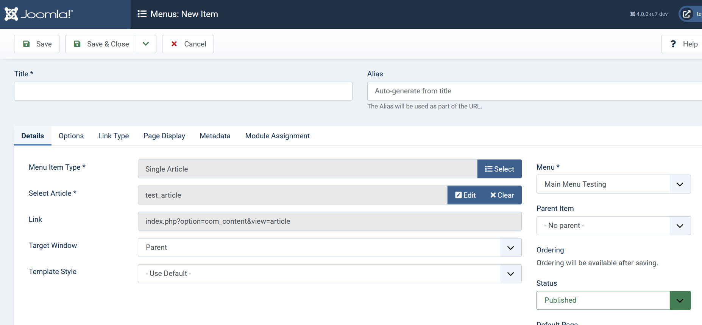
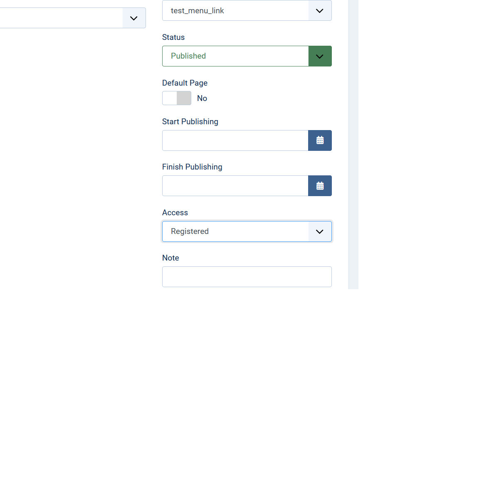
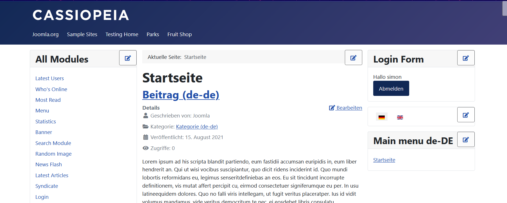

# Einstiegsproject WPW

## Run Project

`docker-compose up`

## SSH
ssh root@localhost -p 9001


## Installation

###  Database Configuration 

* MySQLi
* localhost
* username: root
* pw: leave blank
* database name: joomla_db


## Aufgaben

### User Anlegen

* Dashboard -> Users -> New 



### Workflow

#### Enable
* Content -> Articles -> Options -> Integration -> Enable Workflow



#### create new

* content -> workflows -> new



### Menues







### Languages

Install the sample multi language and open http://localhost:8080/www/projects/joomla-cms/index.php/de/



## Pizza, Bugs & Fun

### Setting up PR

```bash
docker-compose up
ssh root@localhost -p 9001 # or  docker exec -it <containername> bash

(in container shell)
git clone https://github.com/wilsonge/joomla-cms/tree/refactor/image-filter-registry /www/PR_31804
git checkout feature/image-filter-registry
composer i 
npm ci 
```

Install Joomla with 'pr_db' as db name in order to preserve database data and therefore joomla integrity


username: simon
pw: simonsimonsimon


### Removing Joomla installation Config -> Resetting DB connection

delete configuration.php in joomla root directory
